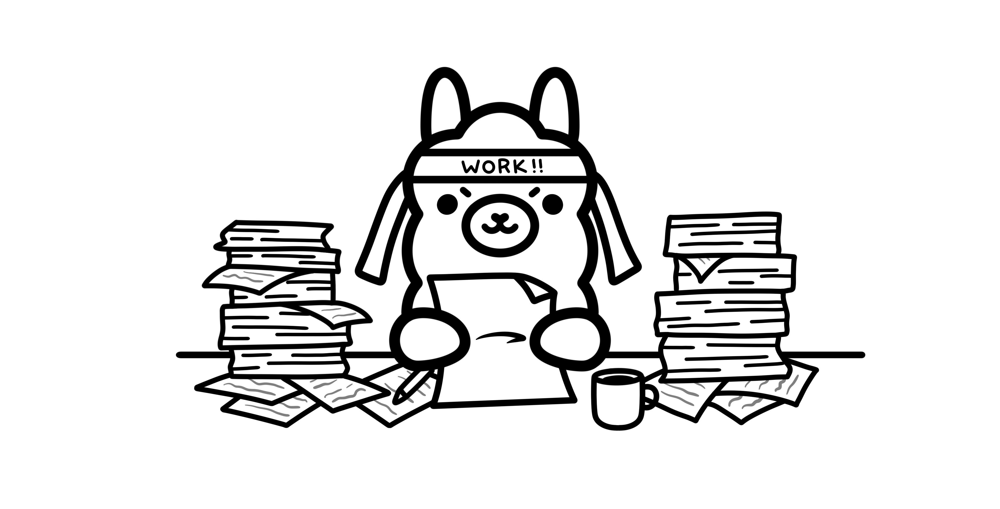

# 2026 Ollama 快速導覽：本地 AI 模型、安裝與硬體需求



在 AI 技術快速普及的 2026 年，越來越多人開始關注一個問題：我能不能在自己的電腦上跑 AI 模型，而不需要依賴雲端服務？答案是肯定的，而讓這件事變得極其簡單的工具，就是 Ollama。Ollama 是一款開源工具，讓任何人都能透過一行指令，在本機電腦上下載並運行大型語言模型（LLM）。從 2023 年推出至今，Ollama 在 2026 年第一季已達到每月 5,200 萬次下載量，相較 2023 年成長了 520 倍，成為本地 AI 運行的事實標準。

這裡將介紹 Ollama 的安裝方式、使用方法、可用模型、效能表現，以及如何與各種 AI 工具整合，幫助你建立完全屬於自己的本地 AI 工作環境。

---

### Table of Contents
1. [為什麼要在本地運行 AI？](#為什麼要在本地運行-ai)<br>
2. [安裝 Ollama](#安裝-ollama)
3. [開始使用：下載並運行第一個模型](#開始使用下載並運行第一個模型)
4. [基本對話範例](#基本對話範例)
5. [熱門模型比較](#熱門模型比較)
6. [核心功能深度解析](#核心功能深度解析)
7. [與 AI 工具整合](#與-ai-工具整合)
8. [效能表現：你需要什麼硬體？](#效能表現你需要什麼硬體)
9. [Ollama vs 雲端 API 比較](#ollama-vs-雲端-api-比較)
10. [常用指令參考](#常用指令參考)
11. [進階使用技巧](#進階使用技巧)
12. [常見問題（FAQ）](#常見問題faq)

---

### 為什麼要在本地運行 AI？

在討論 Ollama 的具體功能之前，先來理解為什麼越來越多開發者和企業選擇在本地運行 AI 模型，而非完全依賴 ChatGPT、Claude 等雲端服務。

#### 隱私與資料安全

當你使用雲端 AI 服務時，你的每一段對話、每一份文件都會傳送到第三方伺服器。對於處理敏感商業資料、個人隱私資訊、醫療紀錄或法律文件的使用者來說，這是一個根本性的問題。在本地運行 AI 模型，所有資料都不會離開你的裝置，完全消除了資料外洩的風險。

這對於受到嚴格法規約束的產業尤其重要。金融業、醫療業、法律業的從業人員，往往無法將客戶資料上傳至任何外部服務。本地 AI 提供了一個合規的解決方案。

#### 成本控制

雲端 AI API 的費用可以快速累積。以 GPT-4o 等級的模型為例，每百萬 token 的輸入費用約 $2.5-5 美元；Claude Opus 等旗艦模型則可達 $15 美元以上，輸出費用更高。對於需要大量使用 AI 的開發者或企業來說，每月的 API 費用可能輕易超過數百甚至數千美元。

相比之下，本地運行模型的邊際成本幾乎為零。一旦你有了足夠的硬體，無論你跑多少次推論、處理多少 token，都不會產生額外費用。對於需要反覆迭代、大量測試的開發場景，這個優勢尤其明顯。

#### 速度與延遲

雲端 API 的回應速度受到網路延遲、伺服器負載等因素影響。在尖峰時段，你可能需要等待數秒才能開始收到回應。而本地模型的推論完全在你的硬體上進行，不受網路狀況影響。

在配備現代 GPU 的消費級電腦上，Ollama 在 RTX 4090 上運行 7B 模型可達到每秒 300 個以上的 token 生成速度；在多 GPU 高階配置上甚至可達每秒 1,200 個 token（具體速度高度依賴模型大小與硬體配置）。這種速度對於需要即時回饋的互動式應用來說至關重要。

#### 離線可用

在飛機上、在沒有穩定網路的偏遠地區、或是在網路中斷時，雲端 AI 服務完全無法使用。本地模型則不受此限制，只要你的電腦能開機，AI 就能運作。這讓本地 AI 成為真正可靠的生產力工具。

#### 客製化與實驗自由

在本地環境中，你可以自由地微調模型、建立自訂的系統提示詞、調整生成參數，甚至創建專屬的模型變體。這種靈活性是雲端服務難以提供的。你可以針對特定任務優化模型表現，而不需要等待服務商推出新功能。

[Table of Contents](#table-of-contents)

---

### 安裝 Ollama

Ollama 的安裝過程極為簡單，支援 macOS、Linux、Windows 及 Docker 環境。以下是各平台的安裝方式。

#### macOS 安裝

macOS 使用者可以直接從官網下載安裝檔，或透過 Homebrew 安裝：

```
brew install ollama
```

安裝完成後，Ollama 會自動在背景運行，監聽 localhost:11434 連接埠。

如果你使用的是 Apple Silicon 機型（M1、M2、M3、M4 系列），Ollama 會自動利用統一記憶體架構來運行模型，不需要額外設定。2026 年 3 月的更新更加入了 `MLX` 框架支援，進一步提升了 Apple Silicon 上的推論效能。

#### Linux 安裝

Linux 上的安裝只需要一行指令：

```
curl -fsSL https://ollama.com/install.sh | sh
```

這個腳本會自動偵測你的系統環境，安裝適當的版本，並設定 systemd 服務讓 Ollama 在開機時自動啟動。支援 Ubuntu、Debian、Fedora、CentOS 等主流發行版。

如果你的系統配備 NVIDIA GPU，安裝腳本會自動偵測並配置 CUDA 支援。AMD GPU 使用者則需要確保已安裝 ROCm 驅動程式。

#### Windows 安裝

Windows 使用者可以從 ollama.com 下載安裝程式，支援 x86_64 和 ARM64 架構。2026 年的更新加入了原生 Windows ARM64 支援，意味著在 Snapdragon X Elite 等 ARM 處理器的筆電上也能流暢運行。

```
winget install Ollama.Ollama
```

安裝後，Ollama 會作為系統服務在背景運行，可透過系統匣圖示進行管理。

#### Docker 安裝

對於需要容器化部署的使用者，Ollama 提供官方 Docker 映像：

```
docker run -d -v ollama:/root/.ollama -p 11434:11434 --name ollama ollama/ollama
```

如果需要 GPU 支援：

```
docker run -d --gpus=all -v ollama:/root/.ollama -p 11434:11434 --name ollama ollama/ollama
```

Docker 方式特別適合伺服器部署或團隊共用的場景，可以輕鬆地在多台機器上複製相同的環境。

[Table of Contents](#table-of-contents)

---

### 開始使用：下載並運行第一個模型

安裝完成後，你只需要兩個指令就能開始與 AI 對話。

#### 下載模型

```
ollama pull gemma4
```

這個指令會從 Ollama 的模型庫下載 Google 的 `Gemma 4 模型`。根據模型大小和你的網路速度，下載可能需要幾分鐘到數十分鐘不等。

#### 運行模型

```
ollama run gemma4
```

執行這個指令後，你會進入一個互動式的對話介面，可以直接開始與模型交談。輸入任何問題或指令，模型會即時回應。

你也可以將兩個步驟合併。如果你直接執行 `ollama run gemma4` 而模型尚未下載，Ollama 會自動先下載模型再啟動對話。

[Table of Contents](#table-of-contents)

---

### 基本對話範例

```
ollama run gemma4
```

    >>> 請用繁體中文解釋什麼是機器學習
        機器學習是人工智慧的一個分支，它讓電腦系統能夠從資料中學習並改善其表現，
        而不需要被明確地程式化。透過分析大量的訓練資料，機器學習演算法可以識別
        模式、做出預測，並隨著接收更多資料而不斷提升準確度...

    >>> /bye
        輸入 /bye 可以結束對話並退出。

#### 非互動模式
你也可以在指令中直接帶入問題，適合在腳本中使用：

```
ollama run gemma4 "用一段話解釋量子計算"
```

這會直接輸出回答，不進入互動模式。

[Table of Contents](#table-of-contents)

---

### 熱門模型比較

Ollama 的模型庫到 2026 年 6 月已超過 4,500 個模型可供選擇。以下是 2026 年最受歡迎的幾個模型比較：

|模型|開發者|可用大小|最佳用途|推論速度|中文能力|
|:--|:--|:--|:--|:--|:--|
Gemma 4|Google|E2B、E4B、26B（MoE）、31B|多模態理解、程式碼生成、通用對話|極快（小模型）|優秀|
Llama 4 / 3.3|Meta|Llama 4: Scout 109B（MoE）; Llama 3.3: 70B|通用對話、創意寫作、推理|中等（70B 量化版較快）|良好|
Mistral Small 3|Mistral AI|24B|程式碼生成、邏輯推理、指令遵循|中等|中等|
Qwen 3|阿里巴巴|0.6B、1.7B、4B、8B、14B、32B、30B-A3B（MoE）、235B-A22B（MoE）|中文對話、程式碼、數學推理|快（小模型）|頂尖|
DeepSeek-R1|DeepSeek|1.5B-70B（基於 Qwen/Llama 蒸餾版）、671B（原生）|複雜推理、數學、程式碼|較慢（思考鏈）|優秀|
Qwen 3.6 27B|阿里巴巴|27B|程式編寫（SWE-bench 77.2%）、中文對話、長上下文|中等|頂尖|
GLM-5.1|智譜 AI（Zhipu）|9B、32B、355B-A32B（MoE）|中文長文檢索、工具呼叫、Agent 任務|中等|頂尖|
Kimi K2.6（雲端）|Moonshot AI|1T MoE / 32B 活躍|長距 coding、agent swarm；本地需 INT4 + 多卡 GPU|中（雲端推論為主）|優秀|

選擇模型時，需要考慮幾個因素。模型大小直接影響記憶體需求 — 一般而言，每 10 億參數約需要 1 到 2 GB 的記憶體（取決於量化精度）。例如，7B 模型通常需要 4 到 8 GB 記憶體，70B 模型則可能需要 40 GB 以上。

對於中文使用者來說，Qwen 3 和 DeepSeek-R1 是目前中文能力最強的開源模型。Gemma 4 的多語言能力也相當出色，特別是在多模態任務上表現突出。

下載特定大小的模型變體：

```
ollama pull qwen3:8b
ollama pull llama3.3:70b
ollama pull deepseek-r1:32b
```

[Table of Contents](#table-of-contents)

---

### 核心功能深度解析

#### Apple Silicon MLX 優化

2026 年 3 月，Ollama 宣布開始整合 Apple 的 MLX 框架（目前為 preview 階段，初期僅支援部分模型如 Qwen 3.6）。MLX 是 Apple 專為自家晶片設計的機器學習框架，能夠利用 Apple Silicon 的統一記憶體架構。值得注意的是，LM Studio 早在 2025 年初就已支援 MLX，Ollama 在這方面屬於後進者。

當 MLX 支援擴展到更多模型後，預期將帶來顯著的效能提升。根據初步測試，在特定模型上使用 MLX 後端的速度比 llama.cpp 後端有所改善。不過目前仍在 preview 階段，廣泛的模型支援還在規劃中。

要啟用 MLX 支援，只需確保 Ollama 更新到最新版本。系統會自動偵測 Apple Silicon 環境並使用 MLX 後端：

```
ollama --version
# 確保版本為 0.18 或以上
```

#### Tool Calling（工具呼叫）

Ollama 支援工具呼叫功能，讓模型能夠與外部工具互動。這意味著你可以讓 AI 不只是生成文字，還能執行計算、查詢資料庫、呼叫 API 等操作。

透過 Ollama 的 API，你可以定義可用的工具清單，模型會在適當的時機決定呼叫哪個工具：

```bash
curl http://localhost:11434/api/chat -d '{
  "model": "gemma4",
  "messages": [
    {"role": "user", "content": "台北現在的天氣如何？"}
  ],
  "tools": [
    {
      "type": "function",
      "function": {
        "name": "get_weather",
        "description": "取得指定城市的天氣資訊",
        "parameters": {
          "type": "object",
          "properties": {
            "city": {"type": "string", "description": "城市名稱"}
          },
          "required": ["city"]
        }
      }
    }
  ]
}'
```

工具呼叫功能是建構 AI Agent 的基礎能力。透過讓模型能夠自主決定何時使用什麼工具，可以建構出能夠完成複雜任務的智慧代理系統。想了解更多 AI Agent 的實作方式，可以參考 [Hermes Agent 教學](https://abmedia.io/hermes-agent-openclaw-migrate)。

#### Web Search API

Ollama 新增的 Web Search 功能讓本地模型也能存取即時的網路資訊。這解決了本地模型的一大痛點 — 訓練資料的時效性問題。透過 Web Search API，模型可以在回答問題時搜尋最新資訊，確保回答的準確性和時效性。

```bash
curl http://localhost:11434/api/chat -d '{
  "model": "gemma4",
  "messages": [
    {"role": "user", "content": "今天比特幣的價格是多少？"}
  ],
  "web_search": true
}'
```

#### OpenAI 相容 API

Ollama 提供了與 OpenAI API 格式完全相容的端點。這意味著任何設計用來連接 OpenAI API 的應用程式，只需要改變 API 端點的 URL，就能直接使用 Ollama 運行的本地模型。

```bash
# 原本連接 OpenAI 的請求
curl https://api.openai.com/v1/chat/completions \
  -H "Authorization: Bearer sk-xxx" \
  -d '{"model": "gpt-4", "messages": [...]}'

# 改用 Ollama 本地模型，只需改 URL 和模型名稱
curl http://localhost:11434/v1/chat/completions \
  -d '{"model": "gemma4", "messages": [...]}'
```

這個相容層支援以下端點：

```bash
/v1/chat/completions — 對話補全
/v1/completions — 文字補全
/v1/embeddings — 文字嵌入
/v1/models — 模型列表
```

這個設計大幅降低了從雲端遷移到本地的門檻。大量現有的 AI 應用、框架和工具都可以無縫切換到本地運行。

#### Python 整合

對於 Python 開發者，Ollama 提供了官方的 Python 套件：

```python
pip install ollama
import ollama

response = ollama.chat(model='gemma4', messages=[
    {'role': 'user', 'content': '請解釋什麼是區塊鏈'}
])
print(response['message']['content'])
```

也可以使用串流模式來即時顯示生成過程：

```python
import ollama

stream = ollama.chat(
    model='gemma4',
    messages=[{'role': 'user', 'content': '寫一首關於台灣的詩'}],
    stream=True
)

for chunk in stream:
    print(chunk['message']['content'], end='', flush=True)
```

#### JavaScript/TypeScript 整合

```javascript
npm install ollama
import { Ollama } from 'ollama';

const ollama = new Ollama();
const response = await ollama.chat({
  model: 'gemma4',
  messages: [{ role: 'user', content: '解釋 TypeScript 的泛型' }],
});
console.log(response.message.content);
```

[Table of Contents](#table-of-contents)

---

### 與 AI 工具整合

Ollama 的真正威力在於它能作為各種 AI 工具的後端。以下是目前主流 AI 工具與 Ollama 的整合方式：

|工具|類型|連接方式|用途說明|
|:--|:--|:--|:--|
|OpenClaw|AI Agent 框架|內建 Ollama 支援，設定模型名稱即可|建構本地 AI 代理，可搭配工具呼叫和 RAG|
|Hermes Agent|AI Agent 平台|透過 OpenAI 相容 API 連接|建構多步驟推理 Agent，支援複雜工作流程|
|Cursor|AI 程式碼編輯器|設定中指定 Ollama 端點為自訂模型|程式碼補全、重構、解釋，完全離線開發|
|Continue|IDE AI 擴充套件|config.json 中設定 Ollama provider|VS Code/JetBrains 中的 AI 程式助手|
|Claude Code（via MCP）|命令列 AI 助手|透過 MCP 協議連接本地 Ollama 服務|終端機中的 AI 編程助手，搭配本地模型|

#### OpenClaw 整合

OpenClaw 是一個專為本地 AI 設計的 Agent 框架，與 Ollama 的整合最為緊密。只需在設定檔中指定使用 Ollama 作為後端：

# openclaw.yaml

```bash
llm:
  provider: ollama
  model: gemma4
  base_url: http://localhost:11434

tools:
  - web_search
  - file_read
  - code_execute
```

完整的 OpenClaw + Ollama 本地 AI Agent 教學，可以參考 [Gemma 4 + Ollama + OpenClaw 本地 AI Agent 教學](https://abmedia.io/gemma-4-ollama-openclaw-local-ai-agent-tutorial)。

#### Cursor 整合

Cursor 是目前最受歡迎的 AI 程式碼編輯器之一。在 Cursor 的設定中，你可以將 Ollama 作為自訂模型提供者：

```bash
# Cursor Settings > Models > Add Model
API Base URL: http://localhost:11434/v1
Model Name: gemma4
API Key: (留空或填任意值)
```

設定完成後，你就可以在 Cursor 中使用本地模型進行程式碼補全和對話，完全不需要網路連接。這對於處理公司內部專案或機密程式碼特別有用。想了解更多 AI 輔助程式開發的技巧，可以參考 [Vibe Coding 完整指南](https://abmedia.io/vibe-coding-complete-guide-2026)。

#### Continue 整合

Continue 是一個開源的 IDE AI 擴充套件，支援 VS Code 和 JetBrains 系列 IDE。設定 Ollama 作為後端：

```json
// ~/.continue/config.json
{
  "models": [
    {
      "title": "Gemma 4 (Local)",
      "provider": "ollama",
      "model": "gemma4"
    }
  ],
  "tabAutocompleteModel": {
    "title": "Qwen 3 4B (Fast)",
    "provider": "ollama",
    "model": "qwen3:4b"
  }
}
```

Continue 的一個優勢是可以為不同任務指定不同模型 — 例如用小型快速模型做程式碼補全，用大型模型做複雜的對話和重構。

### Claude Code 透過 MCP 連接

Claude Code 支援透過 Model Context Protocol（MCP）連接外部工具和資料源。你可以設定一個 MCP server 來橋接 Ollama，讓 Claude Code 能夠呼叫本地模型進行特定任務。關於 MCP 的完整介紹，請參考 [MCP Model Context Protocol 完整指南](https://abmedia.io/mcp-model-context-protocol-complete-guide-2026)，以及 [Claude AI 完整指南](https://abmedia.io/claude-ai-complete-guide-2026)。

### Hermes Agent 整合（v0.21 起）

Ollama 在 2026 年 4 月底的 v0.21.0 版本正式整合 Nous Research 的 Hermes Agent。Hermes 是一個「會自我改進」的 AI 代理人框架、預設搭載 70+ 內建技能、支援跨 session 記憶與自動建立新技能。整合後可以一行指令啟動：

```bash
# 用 Hermes Agent 跑本地模型
ollama launch hermes --model llama4

# 也可以指向 Ollama Cloud 上的大模型
ollama launch hermes --model deepseek-v4-pro:cloud
```

Hermes 與 Ollama 整合的核心價值是「本地 LLM + 自主 agent」—使用者不用把資料送到 OpenAI、Anthropic 或 Google 的雲端、就能讓 AI 代理人自動完成多步驟任務（查資料、寫程式、執行工具、評估結果）。對重視隱私或需要離線工作的使用者特別有用。

需要注意的是、Hermes 的「自我改進」機制會把每次成功完成的任務記錄成新技能、所以第一週使用時技能庫會快速擴張、之後逐漸穩定。如果是用 Ollama Cloud 作後端、Hermes 會把這些技能記憶儲存於本機、不會回傳到 Ollama 伺服器。

[Table of Contents](#table-of-contents)

---

### 效能表現：你需要什麼硬體？

本地運行 AI 模型的效能高度依賴硬體配置。以下是幾種典型硬體配置的表現比較：

|硬體配置|記憶體/VRAM|可運行最大模型|7B 模型速度|70B 模型速度|適合場景|
|:--|:--|:--|:--|:--|:--|
|Mac Mini M4（16GB）|16GB 統一記憶體|~12B（完整）、~30B（量化）|~80 tok/s|無法運行|個人日常使用、輕量開發|
|Mac Mini M4 Pro（36GB）|36GB 統一記憶體|~30B（完整）、~70B（量化）|~120 tok/s|~15 tok/s（4-bit）|專業開發、中型模型|
|Mac Studio M3 Ultra（最高 512GB）|192GB 統一記憶體|~120B（完整）、405B（量化）|~200 tok/s|~50 tok/s|運行最大模型、企業部署|
|PC + RTX 4090（24GB VRAM）|24GB VRAM|~12B（完整）、~30B（量化）|~300 tok/s|無法完整載入|高速推論、遊戲 PC 兼用|
|PC + 2x RTX 4090|48GB VRAM|~30B（完整）、~70B（量化）|~350 tok/s|~25 tok/s|專業 AI 工作站|
|雲端 GPU（A100 80GB）|80GB VRAM|~70B（完整）|~400 tok/s|~60 tok/s|團隊共用、高負載|

#### 記憶體需求估算

判斷你的硬體是否能運行特定模型，最關鍵的因素是可用記憶體（Mac）或 VRAM（PC GPU）。以下是粗略估算：

> - FP16（半精度）：參數量 x 2 = 所需 GB。例如 7B 模型需要約 14GB
> - Q8（8-bit 量化）：參數量 x 1 = 所需 GB。例如 7B 模型需要約 7GB
> - Q4（4-bit 量化）：參數量 x 0.5 = 所需 GB。例如 7B 模型需要約 3.5GB

實際使用時還需要額外記憶體用於 KV cache 和系統開銷，通常需要預留 2 到 4 GB 的額外空間。

#### GPU vs CPU 推論

雖然 Ollama 可以在純 CPU 上運行模型，但 GPU 加速能帶來 5 到 20 倍的速度提升。如果模型太大無法完全載入 GPU 記憶體，Ollama 會自動將部分層放在 CPU 上運行（稱為 `offloading`），但這會顯著降低速度。

對於 Apple Silicon Mac 使用者來說，統一記憶體架構是一大優勢 — GPU 和 CPU 共享同一塊記憶體，模型可以完整載入而不需要在 CPU 和 GPU 之間複製資料。這就是為什麼配備大容量記憶體的 Mac 在運行大型模型時表現出色。

[Table of Contents](#table-of-contents)

---

### Ollama vs 雲端 API 比較

以下是本地 Ollama 與雲端 AI 服務的全面比較：

|比較項目|Ollama（本地）|雲端 API（OpenAI/Anthropic）|
|:--|:--|:--|
|隱私性|完全本地，資料不外傳|資料傳送至第三方伺服器|
|費用|硬體一次性投入，推論免費|按 token 計費，持續支出|
|速度（小模型）|極快，300+ tok/s|中等，受網路延遲影響|
|速度（大模型）|受硬體限制|快速，專業伺服器運行|
|離線可用|完全可用|需要網路連接|
|模型選擇|200+ 開源模型|各家最強模型（GPT-4、Claude）|
|模型品質上限|開源最佳（Llama 405B 等級）|閉源頂尖（GPT-4o、Claude Opus）|
|客製化|完全自由，可微調、修改|有限，依服務商提供的選項|
|可靠性|不受服務中斷影響|可能遇到服務中斷或限流|
|設定難度|需要基本技術知識|取得 API key 即可使用|
|硬體需求|需要足夠記憶體和運算能力|任何能連網的裝置|

#### Ollama Cloud：託管同樣的模型、不需 GPU

Ollama 在 2026 年第一季悄悄推出 Ollama Cloud—一個與本地 Ollama 完全相容的雲端推論服務。對應到一個簡單的場景：「我想用 Hermes Agent 跑 Kimi K2.6（1 兆參數）、但我的 MacBook 跑不動」。Ollama Cloud 把模型權重放在他們的 GPU 集群、使用者只需要在 ollama.com 申請 API key、就能用同樣的 `ollama run` 指令呼叫雲端模型。

使用方式：

```bash
# 設定 API key
export OLLAMA_HOST=https://ollama.com
export OLLAMA_API_KEY=sk-...

# 直接呼叫雲端模型（model name 後加 :cloud）
ollama run deepseek-v4-pro:cloud
ollama run kimi-k2.6:cloud
ollama run gpt-oss-120b:cloud
對 Hermes Agent 使用者來說、設定 Ollama Cloud 後端也很簡單—在 Hermes 設定介面選擇「Ollama Cloud」作為模型供應商、貼上 API key 即可。
```

Ollama Cloud 的計費方式以 token 用量計算、官方目前未公開固定價格表、需透過 ollama.com/settings/keys 申請後查詢。對「偶爾需要超大模型」的使用者來說、按需付費比購買 H100 或租 RunPod 更便宜；對「每天都要重度推論」的使用者來說、本地 RTX 5090 + 80GB RAM 可能仍是長期成本最低的選項。

使用情境決策表：

|使用情境|推薦設定|原因|
|:--|:--|:--|
|日常使用 Llama 4 / Gemma 4 / Mistral 等 8-70B 模型|純本地|M3 Max / RTX 4090 即可、隱私零外洩|
|偶爾要跑 Kimi K2.6 / DeepSeek V4 Pro 等 1T+ 模型|Ollama Cloud|本地跑不動、按需付費合理|
|重度推論 + 隱私要求|本地 + 多卡 GPU|長期成本最低、資料不外傳|
|原型測試 + 不熟硬體|Ollama Cloud 起步|先驗證需求、再決定是否投資硬體|

[Table of Contents](#table-of-contents)

---

### 常用指令參考

以下是 Ollama 常用的命令列指令一覽：

|指令|用途|範例|
|:--|:--|:--|
|ollama run|啟動模型並進入對話|ollama run gemma4|
|ollama pull|下載模型（不啟動）|ollama pull qwen3:8b|
|ollama list|列出已下載的模型|ollama list|
|ollama rm|刪除已下載的模型|ollama rm mistral|
|ollama serve|手動啟動 Ollama 伺服器|ollama serve|
|ollama create|從 Modelfile 建立自訂模型|ollama create mymodel -f Modelfile|
|ollama show|顯示模型的詳細資訊|ollama show gemma4|
|ollama cp|複製模型（建立別名）|ollama cp gemma4 my-gemma|
|ollama ps|顯示正在運行的模型|ollama ps|
|ollama stop|停止正在運行的模型|ollama stop gemma4|

#### 建立自訂模型（Modelfile）

Ollama 允許你透過 Modelfile 建立自訂的模型變體，調整系統提示詞、溫度等參數：

```bash
# Modelfile
FROM gemma4

SYSTEM """你是一位專業的繁體中文技術文件撰寫助手。
你的回答總是使用繁體中文，保持專業但易懂的語氣。
"""

PARAMETER temperature 0.7
PARAMETER top_p 0.9
PARAMETER num_ctx 8192
```

建立模型：

```bash
ollama create zh-tech-writer -f Modelfile
```

之後就可以用 `ollama run zh-tech-writer` 來使用這個客製化的模型。

#### API 使用

除了命令列，Ollama 也可以透過 `REST API` 呼叫：

```bash
# 對話 API
curl http://localhost:11434/api/chat -d '{
  "model": "gemma4",
  "messages": [
    {"role": "system", "content": "你是一個有幫助的繁體中文助手"},
    {"role": "user", "content": "什麼是比特幣？"}
  ],
  "stream": false
}'

# 生成 API（非對話模式）
curl http://localhost:11434/api/generate -d '{
  "model": "gemma4",
  "prompt": "解釋以太坊的智能合約",
  "stream": false
}'

# 嵌入 API
curl http://localhost:11434/api/embed -d '{
  "model": "gemma4",
  "input": "這段文字將被轉換為向量表示"
}'
```

[Table of Contents](#table-of-contents)

---

### 進階使用技巧

#### 同時運行多個模型

Ollama 支援同時載入多個模型。如果你的記憶體足夠，可以在不同的終端機視窗中分別啟動不同模型：

```bash
# 終端機 1
ollama run gemma4

# 終端機 2
ollama run qwen3:8b
```

也可以透過 API 同時向不同模型發送請求，Ollama 會自動管理記憶體分配。

#### 設定環境變數

Ollama 可以透過環境變數進行進階設定：

```bash
# 改變監聽位址（允許網路存取）
OLLAMA_HOST=0.0.0.0:11434 ollama serve

# 設定模型存放路徑
OLLAMA_MODELS=/path/to/models ollama serve

# 設定 GPU 層數
OLLAMA_NUM_GPU=999 ollama serve

# 設定並行請求數
OLLAMA_NUM_PARALLEL=4 ollama serve
```

#### 模型量化與效能調優

Ollama 提供的模型通常已經過量化處理。量化是一種壓縮技術，將模型的浮點數參數轉換為較低精度的表示，大幅減少記憶體需求和提升推論速度，代價是些微的品質下降。

常見的量化等級：

> - Q8_0：8-bit 量化，品質損失極小，大小約為原始的 50%
> - Q5_K_M：5-bit 量化，品質與大小的良好平衡
> - Q4_K_M：4-bit 量化，最受歡迎的選擇，品質尚可
> - Q3_K_M：3-bit 量化，大幅壓縮但品質明顯下降
> - Q2_K：2-bit 量化，極端壓縮，僅適合實驗

選擇量化等級時，Q4_K_M 通常是最佳的平衡點 — 它將模型大小壓縮到原始的約 25%，同時保持了大部分的生成品質。

#### 使用上下文長度

預設情況下，Ollama 模型的上下文長度預設可能為 2048 或 4096 token（新版及新模型如 Gemma 4、Qwen 3 已大幅提升至 128K 以上）。如果你需要處理較長的文件或維持較長的對話歷史，可以透過參數調整：

```bash
ollama run gemma4
>>> /set parameter num_ctx 32768
```

請注意，增加上下文長度會線性增加記憶體使用量。32K 上下文長度大約需要額外 2 到 4 GB 的記憶體（取決於模型大小）。

[Table of Contents](#table-of-contents)

---

### 常見問題（FAQ）

#### Ollama 是免費的嗎？

是的，Ollama 是完全免費的開源軟體，採用 MIT 授權。你可以自由地下載、使用、修改和散佈。模型庫中的所有模型也都是免費下載的。唯一的「成本」是運行模型所需的硬體。

#### 運行 Ollama 需要什麼硬體？

最低要求取決於你想運行的模型大小。對於最小的模型（1 到 3B 參數），8GB 記憶體的電腦就能運行。對於主流的 7 到 8B 模型，建議至少 16GB 記憶體。如果想運行 70B 等級的大型模型，則需要 48GB 以上的記憶體或 VRAM。任何 2020 年後的 Mac（Apple Silicon）或配備現代 NVIDIA GPU 的 PC 都能提供良好的體驗。

#### Ollama 跟 ChatGPT 有什麼差別？

ChatGPT 是 OpenAI 提供的雲端服務，使用的是閉源的 GPT 系列模型，需要網路連接和付費訂閱。Ollama 是一個本地運行的工具，使用開源模型，完全離線運作且免費。在能力上，ChatGPT 使用的頂尖模型目前仍然在某些任務上優於開源模型，但開源模型的差距正在快速縮小，且在許多日常任務上已經足夠好用。Ollama 的核心優勢在於隱私、免費、離線可用和完全的控制權。

#### Ollama 可以用中文嗎？

可以。多數現代開源模型都支援多語言，包括繁體中文和簡體中文。其中 Qwen 3（阿里巴巴開發）和 DeepSeek-R1 的中文能力最為出色，幾乎可以達到母語級別的流暢度。Gemma 4 和 Gemma 4 和 Llama 4 的中文能力也相當不錯。你可以直接用中文提問，模型會用中文回答。

#### GPU 是必要的嗎？

不是必要的，但強烈建議。Ollama 可以在純 CPU 上運行任何模型，但速度會非常慢 — 可能只有每秒幾個 token。有 GPU（NVIDIA CUDA 或 Apple Silicon）的話，速度可以提升 5 到 20 倍。對於 Apple Silicon Mac 使用者來說，這不是問題，因為 GPU 是內建的。對於 PC 使用者，任何 8GB 以上 VRAM 的 NVIDIA GPU（如 RTX 3060 12GB 以上）都能提供良好的體驗。

#### Mac mini 跑得動嗎？

完全可以。Mac mini 搭載 Apple Silicon 晶片，是運行 Ollama 的絕佳選擇。M4 版本的 Mac mini 配備 16GB 統一記憶體，可以流暢運行 7 到 8B 模型，速度可達每秒 60 到 80 個 token。如果選擇 M4 Pro 配 36GB 或 48GB 記憶體的版本，還能運行更大的模型。2026 年 3 月 Ollama 開始整合 MLX 框架（preview 階段），未來預期將進一步提升效能。Mac mini 的低功耗和安靜運行特性，使它成為許多人的本地 AI 伺服器首選。

#### 資料會外洩嗎？

不會。Ollama 完全在本地運行，不會將任何資料傳送到外部伺服器。你的提示詞、對話內容、上傳的文件都留在你的電腦上。唯一的網路連接是在下載模型時需要，一旦模型下載完成，可以完全斷網使用。這是 Ollama 相對於雲端 AI 服務最根本的優勢。

#### 如何更新 Ollama 和模型？

更新 Ollama 本身：

```bash
# macOS（Homebrew）
brew upgrade ollama

# Linux
curl -fsSL https://ollama.com/install.sh | sh
更新已下載的模型到最新版本：

ollama pull gemma4
如果模型有更新的版本，pull 指令會自動下載差異部分。
```

#### 可以多人共用一台 Ollama 伺服器嗎？

可以。只需要將 Ollama 設定為監聽網路介面（而非僅 localhost），團隊中的其他人就可以透過 API 連接使用：

```bash
OLLAMA_HOST=0.0.0.0:11434 ollama serve
```

但請注意安全性 — 確保只在受信任的內網環境中這樣做，或設定適當的防火牆規則和認證機制。

[Table of Contents](#table-of-contents)

---

### 2026 年最新更新

Ollama 在 2026 年持續快速發展，以下是近期最重要的更新：

#### 2026 年 4 月：Kimi K2.6 進入 Ollama 雲端目錄

Moonshot AI 於 2026 年 4 月 20 日發布 Kimi K2.6，1 兆總參數、320 億活躍參數的 MoE 架構，於 SWE-Bench Pro 等基準上領先 Opus 4.6 與 GPT-5.4。Ollama 隨即將其加入 [kimi-k2.6:cloud](https://ollama.com/library/kimi-k2.6:cloud) 目錄—以「雲端模型」方式提供，意即推論在 Ollama 雲端進行、權重不下載到本機，這是 Ollama 處理超大模型（>500B 參數）的常見方案。若想完全本地執行，需到 Hugging Face 取得 moonshotai/Kimi-K2.6 權重，搭配 Unsloth 的 INT4 量化版本與多卡 GPU 才有實際可行性。

#### 2026 年 4 月：DeepSeek V4 Pro 上線 Ollama Cloud

DeepSeek 於 2026 年 4 月 24 日正式發布 V4 Pro 與 V4 Flash 雙模型，Ollama 4 月 27 日同步將 [deepseek-v4-pro:cloud](https://abmedia.io/deepseek-v4-pro-ollama-cloud-claude-code-agent-integration) 加入官方雲端目錄。V4 Pro 為 1.6 兆總參數、490 億活躍參數的 MoE 架構，支援 1M token 上下文窗口，於 SWE-bench、LiveCodeBench、Terminal-Bench 等多項程式編寫基準與 Kimi K2.6 並列開源模型前段班。

使用者只需一行指令即可串接：

```bash
ollama run deepseek-v4-pro:cloud
```

Ollama 同步釋出對主流 agent 工具的整合命令：

```bash
# 透過 Claude Code
ollama launch claude --model deepseek-v4-pro:cloud

# 透過 Hermes Agent
ollama launch hermes --model deepseek-v4-pro:cloud

# 透過 OpenClaw／OpenCode／Codex 也支援
ollama launch openclaw --model deepseek-v4-pro:cloud
```

注意：deepseek-v4-pro:cloud 為雲端模型，推論在 Ollama 雲端進行、權重不下載到本機，這是 Ollama 處理超大模型（>500B 活躍參數）的標準作法。本地完整運行需自 Hugging Face 取得 deepseek-ai/DeepSeek-V4-Pro 權重，搭配 INT4 量化與多卡 GPU 配置。早期社群測試指出雲端推論速度約 30 tokens/s，於高峰時段會降至 1.1 tok/s 上下，視 Ollama 雲端負載而定。

#### 2026 年 3 月：MLX 框架支援

Ollama 開始整合 Apple 的 MLX 機器學習框架（preview 階段）。MLX 專為 Apple Silicon 設計，初期支援 Qwen 3.6 等部分模型，更廣泛的模型支援仍在開發中。

#### 2026 年 3 月：Windows ARM64 原生支援

隨著 Qualcomm Snapdragon X Elite 筆電的普及，Ollama 推出了原生 Windows ARM64 版本。這意味著在 ARM 架構的 Windows 筆電上不再需要透過模擬層運行，效能大幅提升。Snapdragon X Elite 配備的 NPU 也可以用於加速推論。

#### 2026 年初：Web Search API

Ollama 新增了內建的 Web Search 功能，讓本地模型能夠存取即時網路資訊。這個功能可以透過 API 參數啟用，模型會在需要時自動搜尋網路，並將搜尋結果整合到回答中。這大幅提升了本地模型在回答時效性問題時的準確度。

#### 下載量里程碑

2026 年第一季，Ollama 的月下載量達到 5,200 萬次，是 2023 年初創時期的 520 倍。這個數字反映了本地 AI 運行需求的爆發性成長。越來越多的企業和個人開發者意識到本地 AI 的價值，從隱私保護到成本節省，本地部署正在成為 AI 應用的重要形態。

#### 生態系統擴展

Ollama 的生態系統在 2026 年持續壯大。除了前述的 OpenClaw、Hermes Agent、Cursor、Continue 等工具外，越來越多的應用程式和框架加入了 Ollama 支援。這得益於 Ollama 的 OpenAI 相容 API — 任何支援 OpenAI API 的工具，理論上都可以透過簡單的 URL 更改來使用 Ollama。

本地 AI 的浪潮正在改變整個產業的格局。從個人開發者到大型企業，越來越多人選擇在自己的硬體上運行 AI 模型。Ollama 以其極簡的使用體驗和強大的功能，成為這場本地 AI 革命的核心工具。無論你是想保護隱私、節省成本、還是追求更快的回應速度，Ollama 都提供了一個成熟可靠的解決方案。

#### 2026 年 5 月：v0.21-v0.24.0 版本快覽

從 4 月底到 5 月中、Ollama 連續推出 5 個版本、平均每週一個小版本：

|版本|日期|重點功能|
|:--|:--|:--|
|v0.24.0|5 月 14 日|支援 OpenAI Codex App（worktree／git、內建瀏覽器可標註頁面）、MLX sampler 重寫提升 Apple Silicon 生成品質、整合 Claude Desktop（可在其中執行 Cowork／Claude Code）|
|v0.23.3|5 月 12 日|Bug 修復、MLX runner 推送行為優化、macOS 26 Metal library 編譯修正|
|v0.23.2|5 月 7 日|API show 回應快取、中位延遲降低約 6.7 倍；VS Code 等整合工具有感|
|v0.23.1|5 月 5 日|Gemma 4 MTP 推測解碼支援 Mac、程式編寫速度提升 2 倍以上|
|v0.23.0|5 月 3 日|Claude Desktop 整合（ollama launch claude）、Metal 初始化強化|
|v0.22.1|4 月 28 日|Gemma 4 渲染器更新、思考與工具呼叫改進|
|v0.21.0|4 月中下旬|Hermes Agent 整合、Copilot CLI 支援、Windows WSL 改進|

這個節奏顯示 Ollama 在 2026 年 5 月正快速擴張「整合層」與「效能層」—一邊把更多 AI 工具（Claude Desktop、Hermes Agent、Copilot CLI）整合進 ollama launch 命令、一邊持續優化 MLX 後端與 API 快取。

#### 2026 年 5 月底至 6 月初：Qwen 3.6 27B、GLM-5.1 進入 Ollama 模型庫

5 月底到 6 月初的兩個重要新增是阿里巴巴 Qwen 3.6 27B 與智譜 GLM-5.1。Qwen 3.6 27B 在 SWE-bench 程式編寫評測達 77.2%，是其大小級別的中文程式碼模型新標竿，已可透過 ollama pull qwen3.6:27b 取得。智譜 GLM-5.1 同步進入 Ollama 模型庫，提供 9B、32B 與 355B-A32B（MoE）三種規格，主打中文長文檢索與 Agent 任務。中文社群最關注的選擇路徑大致為：通用對話用 Qwen 3、推理用 DeepSeek-R1、程式編寫用 Qwen 3.6 27B、Agent 任務用 GLM-5.1。

另一個值得關注的訊號是 Ollama 模型庫已突破 4,500 個模型，4 月時還停在約 3,000 個。這個擴張速度反映兩個趨勢：開源模型發布頻率明顯加快（從季度級到月級）、社群把 Hugging Face 上的微調與量化版本同步整合進 Ollama 的速度也加快。對個別使用者而言，模型選擇的成本與資訊不對稱也同步提高，這也是維持本指南更新節奏的主因之一。

#### 2026 年 6 月：v0.30.x 系列、引擎切換與整合大爆發

進入 6 月後，Ollama 在 5 天內連續推出 v0.30.2 至 v0.30.8 共 7 個版本，節奏比 5 月更密集。這一切的起點是 v0.30.0（5 月 13 日）所做的核心引擎切換：把 llama.cpp 改為主要推論引擎、Apple Silicon 仍維持 MLX 後端、同時擴大對 GGUF 模型格式與更多硬體（含 AMD Radeon 內顯）的相容性。代價是 llama3.2-vision 在 v0.30.0 後不再支援，nomic-embed-text 改為自動將輸入轉小寫以符合模型規格，依賴這兩者的使用者需要評估替代方案。

|版本|日期|重點功能|
|:--|:--|:--|
|v0.30.8|6 月 12 日|ollama launch 啟動器選擇修正、MLX 線性與嵌入層強化、解耦 prompt 快取與 context shift、補強 recurrent 模型支援|
|v0.30.7|6 月 7 日|Hermes Desktop 原生桌面介面（ollama launch hermes-desktop）、OpenAI 相容 API 模型清單與可用 tag 對齊|
|v0.30.6|6 月 5 日|Gemma 4 QAT 量化感知訓練權重、Oh My Pi▲ 編碼 agent 整合（ollama launch omp）、MLX 嵌入量化改進|
|v0.30.5|6 月 4 日|gemma4:12b 於 x86／CUDA／Linux／Windows 浮點崩潰修復、Hermes 原生 Windows 安裝包|
|v0.30.4|6 月 3 日|Nemotron-3-Ultra 加入模型庫、Apple Silicon multimodal 模型啟用 Metal GPU 加速、ollama create --experimental 支援 MLX REQUIRES 指令、llama.cpp Windows 後端清理改進|
|v0.30.3|6 月 3 日|Gemma 4 12B multimodal 支援|
|v0.30.2|6 月 3 日|Qwen Code 整合（偵測缺失時自動引導安裝 Cline CLI）、Codex 隔離啟動模式、Poolside Laguna 架構於 llama.cpp 後端啟用、AMD Radeon 8060S GPU 啟用、快取 prompt token 計算修正|
|v0.30.0|5 月 13 日|核心引擎切換為 llama.cpp（Apple Silicon 保留 MLX）、擴大 GGUF 與硬體相容；llama3.2-vision 暫不支援、nomic-embed-text 改自動 lowercase|

從 v0.30.x 的節奏可以看出 Ollama 的方向：一邊把 llama.cpp 接回主幹來換取更廣的硬體覆蓋（v0.30.0、v0.30.4 的 Radeon 8060S），一邊持續把更多編碼 agent 整合到單一指令（v0.30.2 的 Qwen Code、v0.30.4 的 Cline、v0.30.6 的 Oh My Pi▲、v0.30.7 的 Hermes Desktop）。對使用者而言，「裝好 Ollama 之後再裝什麼工具」這個問題的答案，正在被 ollama launch 系列指令逐步收斂。

#### NVIDIA Nemotron-3-Ultra：550B MoE、1M context、為長時間 agent 工作流而生

v0.30.4（6 月 3 日）與 NVIDIA 在 6 月 4 日的官方公布同步、把 Nemotron-3-Ultra 帶進 Ollama 模型庫。NVIDIA 官方確認的規格包括：總參數 550B、每 token 啟動 55B（典型 MoE 配置）、1M token 上下文視窗、原生為 NVFP4（NVIDIA 自家 4 位元浮點格式）優化。授權方面採 Linux Foundation 主導的 OpenMDW-1.1，是專為開源 AI 模型發行設計的寬鬆授權。

Nemotron-3-Ultra 的市場定位明確：長時間運行的 agent 工作流。1M context 可以把整個程式碼庫、過去幾百次工具呼叫的歷史、研究軌跡同時放在脈絡中而不丟失主線。NVIDIA 在 Long Context Ruler @1M 評測達 95% 準確率、並宣稱對同級其他開源模型有 5 倍吞吐優勢（以 NVFP4 對 BF16 Blackwell 的對照）。

對 Ollama 使用者最直接的影響是，ollama pull nemotron-3-ultra 之後即可在本機（或透過 Ollama Cloud 後端）使用一款專為 agent 場景優化的 frontier 級模型。考慮到 550B 的尺寸，多數個人裝置會傾向走 Cloud 路線；本地部署則需要 NVFP4 量化版本搭配多張 Blackwell 級 GPU（B200 等）。

#### Hermes Desktop：本地 AI agent 走向桌面 GUI

v0.30.7（6 月 7 日）把 Nous Research 的 Hermes Desktop 加入 ollama launch 系列、為先前已整合的 Hermes Agent 補上原生圖形介面。用法是 ollama launch hermes-desktop，會啟動 Hermes Desktop 並連到本機 Hermes Agent；若機器上已安裝官方桌面包則直接啟動、不重新建置。原生 Windows 設定路徑也在此版本一併補上。

Hermes Desktop 的角色是「Hermes Agent 的視覺化前端」，集中提供對話視窗、整合管理、訊息應用串接等介面。對需要把本地 LLM 與 agent 帶到團隊或非工程同事場景的使用者而言，桌面 GUI 是把先前 CLI-only 工作流推向更廣使用基礎的關鍵一步。

### 新整合工具：Cline CLI、Qwen Code、Oh My Pi▲

除 Hermes Desktop 外、v0.30.x 系列還把三款編碼 agent 整合進 ollama launch：

> - **Cline CLI 自動安裝（v0.30.2）：**<br>原本以 VS Code 擴充元件為主的 Cline 也有 CLI 版本；v0.30.2 起，ollama launch 偵測到使用者呼叫 Cline 但 CLI 缺失時，會主動引導安裝、省去手動 npm 步驟。
> - **Qwen Code（v0.30.2）：**<br>阿里巴巴 Qwen 團隊推出的編碼 agent、預設搭配 Qwen 3 Coder 系列模型、以指令為中心的 CLI 介面。
> - **Oh My Pi▲（v0.30.6）：**<br>以 ollama launch omp 啟動的編碼 agent、社群維護、強調極簡配置與快速啟動。

連同 4 月的 Hermes Agent、5 月的 Copilot CLI 與 Claude Desktop、6 月的 Hermes Desktop，ollama launch 已經是一個功能型 launcher，可一行指令喚起 Anthropic Claude Desktop、GitHub Copilot CLI、OpenAI Codex App、Nous Hermes Agent／Desktop、Qwen Code、Oh My Pi▲ 等主要 AI 工具，並對缺失的 Cline CLI 自動引導安裝。對使用者來說，安裝 Ollama 後不需再個別安裝這些工具的官方包，一條命令搞定。

### v0.30.8 KV 快取與 MLX 強化：長對話與 agent 工作流受益

v0.30.8（6 月 12 日）把「prompt 快取」與「context shift」這兩個原本耦合的機制解耦，KV 快取的效率因此提升，特別有助於長對話與 agent 工作流中反覆使用相同前綴的場景。同版本還對 MLX 的線性與嵌入層做了強化、新增 MLX prompt 處理與推測解碼期間的 snapshot 建立，Apple Silicon 使用者體感最明顯。

對開發者而言，這代表 Ollama 在 v0.30 系列同時拓寬了「橫向」（更多硬體、更多整合）與「縱向」（長脈絡 KV 快取效率、MLX 後端品質）兩個維度，與年初仍以「下載模型、跑 chat」為主的使用情境已經大不相同。

資料更新至 2026 年 6 月 13 日。版本資訊以 [Ollama GitHub releases](https://github.com/ollama/ollama/releases) 為準。

[Table of Contents](#table-of-contents)
