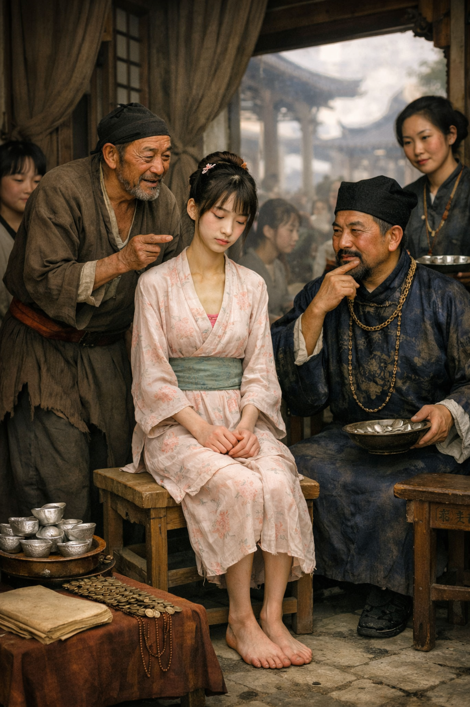

# 揚州瘦馬 典故

「`揚州瘦馬`」並不是一種馬，而是明清時期一場令人唏噓的女性悲劇。當時的揚州是富商聚居的地方，人販子會買下窮苦人家的漂亮女童，把她們當作「商品」一樣養大、調教，最後高價賣給富豪當小妾，這就是「揚州瘦馬」的典故。維基百科[^1]

[^1]: [維基百科](https://zh.wikipedia.org/zh-tw/%E9%A4%8A%E7%98%A6%E9%A6%AC)

我們可以從以下幾個方面來了解這個典故：

### 名字的由來

這個名字來自於當時的商人文化。那時的商人有一種賺錢方法，就是低價買進瘦弱的馬匹，把馬養肥、訓練好之後，再高價賣出去。人販子用同樣的方法來對待這些可憐的女孩，加上明清時期的有錢人特別喜歡身材纖瘦、弱不經風的女性，所以大家就把這些女孩叫做「瘦馬」。維基百科[^1]

### 畸形的養成產業

當時的揚州因為鹽業非常發達，聚集了全中國最有錢的鹽商，生活過得非常奢靡。為了解決這些富商的需求，揚州城裡出現了專門的「瘦馬產業鏈」：維基百科[^2]

[^2]: [維基百科](https://www.chinatimes.com/hottopic/20250208001197-260812)

- 低價買入：人販子（牙公、牙婆）會用很少的錢，從過不下去的窮苦人家手中買下長相好看的小女孩。
- 嚴格調教：女孩們會接受長達數年的訓練。她們要學習歌舞、琴棋書畫、走路儀態，甚至要挨餓來保持骨感的身材，還要纏足（裹小腳）。
-高價賣出：等女孩長大後，人販子會舉辦像選美一樣的聚會讓富商挑選。原本只花幾十兩銀子買來的女孩，可以賣到上千兩銀子，利潤高達數百倍。維基百科[^3]

[^3]: [維基百科](https://tw.news.yahoo.com/%E8%B6%85%E8%AE%8A%E6%85%8B-%E5%8F%A4%E4%BB%A3%E7%94%B7%E4%BA%BA%E5%B0%88%E5%B1%AC%E7%8E%A9%E7%89%A9-%E6%8F%9A%E5%B7%9E%E7%98%A6%E9%A6%AC-052107988.html)

### 女孩們的悲慘命運

這些女孩的命運通常由不得自己，主要會走向兩種結局：維基百科[^1]

- 被選中的女孩：雖然可以嫁進豪門當小妾，從此不用擔心吃穿，但因為地位低下，常被正妻嫉妒和虐待，生活並不快樂。
- 被挑剩下的女孩：如果長大後長相不夠出眾，或者沒有被富商看中，命運會更慘。她們會被直接賣進妓院，成為秦淮河畔的娼妓。維基百科[^2]

這個典故背後，其實是古代女性被徹底「商品化」與物化的悲傷歷史。百度百科[^4]

[^4]: [百度百科](https://baike.baidu.com/item/%E6%89%AC%E5%B7%9E%E7%98%A6%E9%A9%AC/10854705)

